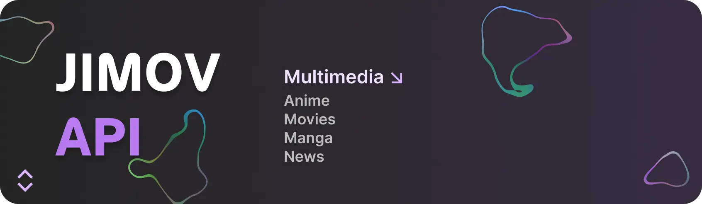

  

# JIMOV API Docs

Official documentation site for the [JIMOV API](https://github.com/koikiss-dev/jimov_api) — an open-source REST API for retrieving multimedia content such as anime, movies, series, news, and manga in both Spanish and English.

## About the Project

[JIMOV API](https://github.com/koikiss-dev/jimov_api) is built with Node.js and Express.js. It scrapes and organizes content from multiple providers, offering a unified interface to search, filter, and retrieve detailed information about anime, manga, and more.

This repository contains the documentation site, built with [Nuxt](https://nuxt.com/) and [Docus](https://docus.dev/), covering all available endpoints, parameters, response schemas, and code examples in JavaScript and Python.

## Main Repository

The API source code lives at [github.com/koikiss-dev/jimov_api](https://github.com/koikiss-dev/jimov_api).

## Features

- Open-source REST API
- Content in Spanish and English
- Multiple providers: AnimeFlv, AnimeLatinoHD, TioAnime, MonosChinos, GogoAnime, Zoro, Comick, InManga, and more
- Search and filter by language, genre, status, and content type
- Full documentation with code examples
